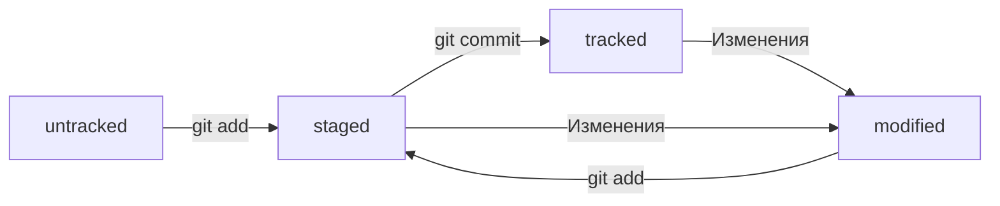

# Основы работы с Git
Это _тестовый_ **учебный** проект для изучения работы с GitHub.
Как же *приятно* в конце курса получить задание... по конспекту... _ВСЕГО КУРСА_... ммм...
## Консольные команды
1. pwd (от англ. print working directory — «показать рабочую папку»). Она выводит путь к текущей директории.   
```
$ pwd
/c/Users/%USERNAME%
```
2. cd (от англ. change directory — «сменить директорию»)
  + Домашняя директория  
  ```cd ~```  
  + Вернуться в **родительскую директорию**  
  ```cd ..```  
  + Вернуть текущую директорию (. используется не только с cd)  
  ```cd .```  
  + Перейти в корневую директорию    
  ```cd /```
3. ls (от англ. list directory contents — «отобразить содержимое директории»)  
  + Включая скрытые файлы  
  ```ls -a```
4. touch (англ. «коснуться»), создаёт файл.  
```$ touch my-new-file.txt```
5. mkdir (от англ. make directory — «создать директорию»)  
```$ mkdir new-dir```
  + Cтруктура директорий    
  ```$ mkdir -p dir1/dir-inside/dir-deeper-inside```
6. cp (от англ. copy — «копировать»)  
```$ cp что_копируем куда_копируем```
7. mv (от англ. move — «переместить»)  
```mv table.csv ./very-important-files```
8. cat (от англ. concatenate and print — «объединить и распечатать»)  
```
$ cat myfile.txt  
file-content-1  
file-content-2 
```
9. rm (от англ. remove — «удалить») 
10. rmdir (от англ. remove directory — «удалить директорию»)  
```$ rmdir images```
  + Удалить непустую папку  
  ```$ rm -r images```
11. Выполнить сразу несколько команд  
```
$ mkdir second-project && cd second-project && touch index.html style.css
```
12. git init (от англ. initialize — «инициализировать»)  
```
$ cd ~/dev/first-project  
$ git init
```
13. rm -rf .git «Разгитить» папку, если что-то пошло не так  
```
$ cd <папка с репозиторием>  
$ rm -rf .git
```
14. git status Проверить состояние репозитория
15. git (--all) Подготовить к сохранению (все) файл(ы) в репозитории
16. git commit Выполнить коммит  
  + Добавить комментарий  
  ```
  $ git commit -m 'Мой первый коммит!'
  ```
  + Внести правки в уже сделанный коммит
  ```
  git commit --amend
  ```
  + Не изменять сообщение коммита
  ```
  $ git commit --amend --no-edit
  ```
17. git log Просмотреть историю коммитов
  + Получить сокращённый лог
  ```
  git log --oneline
  ```
18. clip Скопировать содержимое
19. git push Отправить изменения на удалённый репозиторий  
```
$ git push -u origin main
```
20. git restore --staged <file> Выполнить unstage изменений
21. git reset --hard <commit hash> «Откатить» коммит
22. git restore <file> «Откатить» изменения, которые не попали ни в staging, ни в коммит
23. git diff Просмотреть изменения в коммите
  + Просмотреть изменения в staged
  ```
  git diff --staged
  ```
24. echo Вывод в консоль
25. Перенаправлене вывода
```
echo "Вторая строка файла" >> file.txt
```
26. Перенаправление, включающее перезапись
```
$ cat file.txt
Первая строка файла
$ echo "Новая строка" > file.txt
$ cat file.txt
Новая строка 
```

В дальнейшем при работе с удалённым репозиторием флаг *-u* можно опустить и 
писать просто *git push*.

## Настройка окружения и знакомство с командной строкой
### Командная строка
#### Установка командной строки для пользователей Windows
[Вот отсюда](https://git-scm.com/download/win) качаем командную строку.
#### Знакомство с командной строкой
##### Графический интерфейс vs командная строка
У программ есть привычный **графический интерфейс** (англ. **G**raphical **U**ser  
**I**nterface, или *GUI*). Это окна, значки, кнопки, выпадающее меню с настройками и   
прочие элементы.
**Командная строка** (англ. **C**ommand-**l**ine **I**nterface, или *CLI*) — тоже интерфейс,  
только текстовый. Пользователь вводит в неё команды. Она принимает их от  
пользователя и выполняет.  
Командную строку часто называют **терминалом** или **консолью**.
### Настройка Git
В качестве значения user.name нужно указать своё имя или никнейм.  
Для  настройки параметра user.email указывают электронную почту.
```
$ git config --global user.name "User Namovich"

$ git config --global user.email username@yandex.ru
```
## Начало работы с Git
### Регистрация на GitHub
1. В правом верхнем углу [главной страницы GitHub](https://github.com/) нажмите на **Sign up** (англ.  
«зарегистрироваться»).
2. На экране будут последовательно появляться поля для ввода.
  *Введите адрес электронной почты (англ. Enter your email).
  *Придумайте пароль (англ. Create a password).
  *Введите имя пользователя (англ. Enter a username).
3. Нажмите кнопку **Continue** (англ. «продолжить»).
4. GitHub предложит вам пройти *капчу*. Сделайте это.
5. После прохождения капчи нажмите **Create account** (англ.  «создать  
аккаунт»).
6. Введите короткий код, который будет отправлен на указанный вами почтовый адрес.
### Создаём удалённый репозиторий
1. Зайдите в свой профиль по ссылке *https://github.com/username*, где *username*
— имя, которое вы указали при регистрации.
2. Создайте репозиторий. Для этого перейдите на вкладку **Repositories** (англ.  
«репозитории»), а затем нажмите на зелёную кнопку **New** (англ. «новый»)  
справа.
3. Открылось окно создания нового репозитория. Назовите его *first-project*. 
Название удалённого репозитория необязательно должно совпадать с 
именем папки проекта у вас на компьютере. Но чтобы не путаться, будем 
называть их одинаково.

Другие поля вам пока не понадобятся. Смело нажимайте на зелёную кнопку 
**Create repository** (англ. «создать репозиторий») внизу.
### Что такое SSH. Генерируем SSH-ключ
Когда компьютеры обмениваются данными в сети, они следуют **сетевым  
протоколам** (англ. network protocols) — правилам обмена данными между 
компьютерами.

Один из наиболее распространённых сетевых протоколов — **SSH** (от англ. **S**ecure
**Sh**ell Protocol). Он обеспечивает безопасный обмен данными в сети. С помощью
этого протокола можно получать данные с удалённого компьютера или 
отправлять их на него. Трафик шифруется, поэтому протокол безопасен.

SSH использует пару ключей для обеспечения безопасности — публичный и  
приватный: 
+ **Приватный ключ** (англ. *private key*) хранится только на вашем компьютере и  
не должен передаваться кому-либо ещё. Он используется для расшифровки  
данных.
+ **Публичный ключ** (англ. *public key*) доступен всем и используется для 
шифрования данных. Они могут быть расшифрованы парным приватным  
ключом.
#### Проверка наличия SSH-ключа
```
$ cd ~
$ ls -la .ssh/
```
Если папка пустая или её нет, всё в порядке.  
Если есть файлы с похожими названиями, SSH-ключи уже создавались.
+ id_dsa.pub
+ id_ecdsa.pub
+ id_ed25519.pub
+ id_rsa.pub
Если вы не создавали эти файлы, удалите их все.
#### Привязываем SSH-ключ к GitHub
1. Скопируйте содержимое ключа в буфер обмена.
2. Перейдите на GitHub и выберите пункт **Settings** (англ. «настройки») в меню  
аккаунта.
3. В меню слева нажмите на пункт **SSH and GPG keys**.
4. В открывшейся вкладке выберите **New SSH key** (англ. «новый SSH-ключ»).
5. В поле **Title** (англ. «заголовок») напишите название ключа. Например, 
**Personal key** (англ. «личный ключ»).
6. В поле **Key type** (англ. «тип ключа») должно быть **Authentication Key** (англ. 
«ключ аутентификации»).
7. В поле **Key** скопируйте ваш ключ из буфера обмена.
8. Нажмите на кнопку **Add SSH key** (англ. «добавить SSH-ключ»).
9. Проверьте правильность ключа с помощью следующей команды.  
```$ ssh -T git@github.com```
### Связываем локальный и удалённый репозитории
Откройте консоль, перейдите в каталог локального репозитория и введите  
команду *git remote add* (от англ. *remote* — «удалённый» и *add* — «добавить»).
```
$ cd ~/dev/first-project  
$ git remote add origin git@github.com:%ИМЯ_АККАУНТА%/first-project.git
```

*origin* (англ. «источник») — стандартный псевдоним, с помощью которого можно 
обращаться к главному удалённому репозиторию (обычно такой репозиторий 
один). Это значительно упрощает работу.
Убедиться, что репозитории связаны, — *git remote -v*
```
$ git remote -v
origin    git@github.com:%ИМЯ_АККАУНТА%/%ИМЯ-ПРОЕКТА%.git (fetch)
origin    git@github.com:%ИМЯ_АККАУНТА%/%ИМЯ-ПРОЕКТА%.git (push) 
```
Флаг *-v* — короткая форма флага *--verbose* (англ. «подробный»). Он позволяет 
показать больше информации в выводе.
### Хеш — идентификатор коммита
**Хеширование** (от англ. *hash*, «рубить», «крошить», «мешанина») — это способ  
преобразовать набор данных и получить их «*отпечаток*» (англ. *fingerprint*).

Информация о коммите — это набор данных: когда был сделан коммит, 
содержимое файлов в репозитории на момент коммита и ссылка на предыдущий, 
или **родительский** (англ. *parent*), коммит.

Git хеширует (преобразует) информацию о коммите с помощью алгоритма **SHA-1** 
(от англ. **S**ecure **H**ash **A**lgorithm — «безопасный алгоритм хеширования») и 
получает для каждого коммита свой уникальный **хеш** — результат хеширования.

Все хеши, а также таблицу соответствий ```хеш → информация о коммите``` Git  
хранит в папке ```.git```.
### HEAD — всему голова
Файл ```HEAD``` (англ. «голова», «головной») — один из служебных файлов папки  
```.git```. Он указывает на коммит, который сделан последним (то есть на самый 
новый).

В этом можно убедиться с помощью терминала.
```
$ pwd
/Users/user/dev/first-project

$ cd .git/
$ ls
COMMIT_EDITMSG  ORIG_HEAD  description  index  logs/     refs/
HEAD            config     hooks/       info/  objects/

$ cat HEAD
ref: refs/heads/master
```

Вместо хеша последнего коммита можно написать слово ```HEAD``` — Git вас поймёт.
### Статусы файлов в Git



### Игнорирование файлов в Git
#### Как заполнить ```.gitignore```
С точки зрения Git ```.gitignore``` — это обычный текстовый файл. Его добавляют в 
корень репозитория и тоже коммитят.

В простейшем случае в ```.gitignore``` указывают все файлы, которые нужно  
игнорировать (по одному имени на строку). Но часто удобнее использовать  
**шаблоны**. Шаблон, или правило, — это способ указать сразу на несколько  
файлов с однотипными названиями.

> Правила из .gitignore применяются только к новым (untracked) файлам.  
> Если файл уже попал в staging area или в коммит, то правила на него не  
> распространяются.

##### Комментарий
Если строка начинается с ```#```, то это комментарий, и ```.gitignore``` не будет его  
учитывать. 
```
# вот так можно писать комментарии;
# они ничего не значат для .gitignore,
# но они могут быть полезны, чтобы понять, зачем было добавлено то или иное правило 
```
##### Просто название файла
Допустим, нужно, чтобы Git игнорировал все файлы ```.DS_Store```. Для этого 
достаточно добавить в ```.gitignore``` строку с названием файла.
```
.DS_Store 
```
##### Звёздочка
Символ звёздочки (```*```) соответствует любой строке, включая пустую. Если такой 
символ используется в шаблоне в ```.gitignore```, значит, файл будет проигнорирован 
вне зависимости от того, что будет на месте звёздочки.
```
# игнорировать все файлы, которые заканчиваются на .jpeg
*.jpeg

# игнорировать все файлы "tmp" во всех подпапках папки docs
docs/*/tmp 
```
##### Вопросительный знак
Вопросительный знак ```?``` соответствует одному любому символу.
```
file?.txt 
```
##### Квадратные скобки
Квадратные скобки, как и вопросительный знак, соответствуют одному символу.   
При этом символ не любой, а только из списка, который указан в скобках.
```
# игнорировать файлы file0.txt, file1.txt и file2.txt
# при этом не игнорировать file3.txt, file4.txt, ...
file[0-2].txt 
```
##### Слеш
Косая черта, или слеш (```/```), указывает на каталоги. Если шаблон в ```.gitignore```  
начинается со слеша, то Git проигнорирует файлы или каталоги только в корневой  
директории.
##### Восклицательный знак
Любое правило в файле ```.gitignore``` можно инвертировать с помощью  
восклицательного знака (```!```).
```
# игнорировать все JPEG-файлы
*.jpeg

# но только не мем с Doge
!doge.jpeg 
```